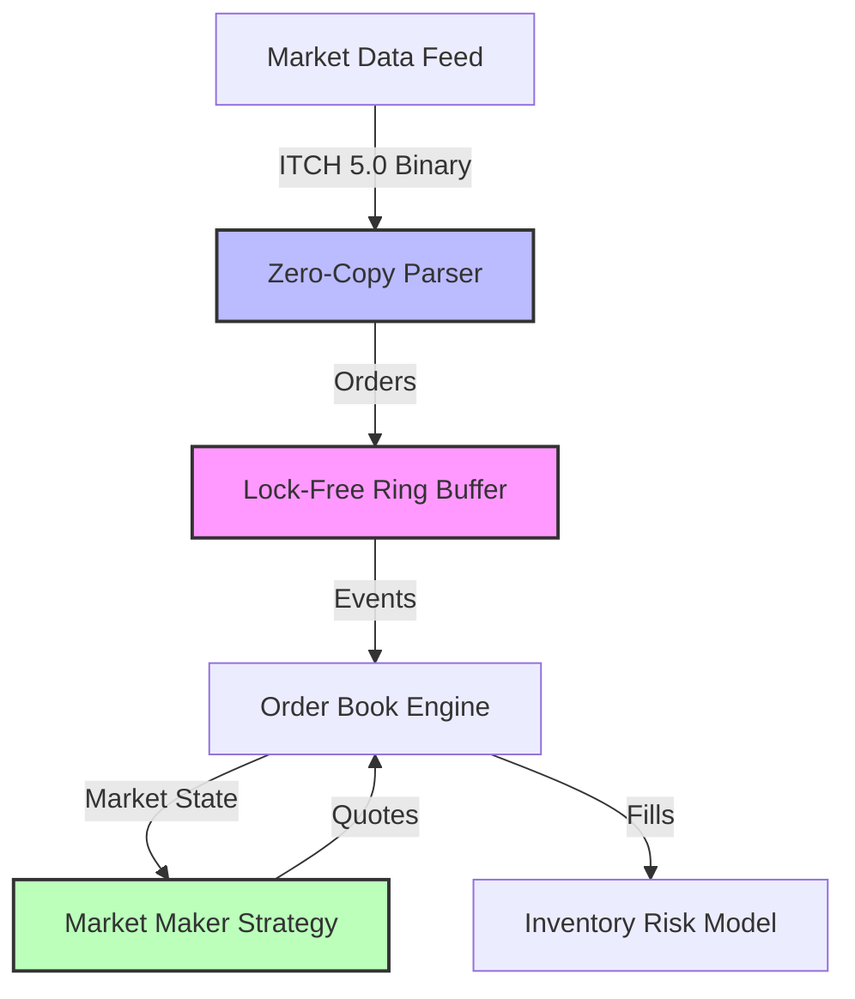

# MiniHFT - High-Frequency Trading Engine

[]()
[](LICENSE)
[](https://isocpp.org/)
[]()

> A production-grade educational HFT engine demonstrating advanced C++, quantitative finance, and low-latency systems concepts.

**Built for learning**: Lock-free concurrency, NASDAQ ITCH 5.0 parsing, market microstructure, and hardware acceleration.

---

## 🎯 Why This Project?

This project showcases the intersection of **quantitative finance**, **systems programming**, and **mathematical modeling**:

- **For Recruiters**: Demonstrates production HFT concepts (lock-free data structures, ITCH protocol, kernel bypass)
- **For Learners**: Complete implementation from math fundamentals to hardware simulation
- **For Researchers**: Reference implementation of Avellaneda-Stoikov market making model

## 🏗️ Architecture



## 🚀 Features

### Core Infrastructure
- ✅ **Lock-Free Ring Buffer** - Disruptor pattern, ~50–70 ns median one-way latency between pinned cores
- ✅ **Thread Pinning** - CPU core isolation for deterministic performance
- ✅ **Zero-Copy Parsing** - Direct memory mapping, no allocations
- ✅ **Cache Optimization** - `alignas(64)` to prevent false sharing

### Market Microstructure
- ✅ **Limit Order Book** - Price-time priority matching engine
- ✅ **NASDAQ ITCH 5.0 Parser** - Binary protocol with endianness conversion
- ✅ **Market Simulator** - Synthetic order flow generation

### Quantitative Models
- ✅ **Avellaneda-Stoikov** - Inventory risk model with optimal quoting
- ✅ **Statistics Library** - Mean, variance, covariance, moving averages
- ✅ **Matrix Operations** - Template-based linear algebra

### Hardware Concepts
- ✅ **FPGA Pipeline Simulation** - 3-stage pipelined processing
- ✅ **Kernel Bypass Simulation** - Poll Mode Driver (PMD) concept

## 📊 Performance

Measured on an AMD Ryzen 9 9900X3D running with one CCD enabled and SMT off (6 cores), Windows 11 and WSL2. Timestamps come from the CPU's time-stamp counter, and percentiles from `LatencyHistogram` (at most 1.6 % bucket error). Every figure includes about 10 ns of timer overhead.

### Ring buffer: one-way latency between two pinned threads

`ring_latency`: one message every 1 µs from core 2 to core 3 (same CCD), 1,000,000 measured after 50,000 warm-up.

| Configuration | p50 | p90 | p99 | p99.9 | max |
|---------------|-----|-----|-----|-------|-----|
| Windows, MSVC, high priority | 50 ns | 70 ns | 0.9 µs | 222 µs | 500 µs |
| Windows, MSVC, normal priority | 70 ns | 80 ns | 140 µs | 530 µs | 1.06 ms |
| Linux (WSL2), GCC 13, normal priority | 71 ns | 113 ns | 103 µs | 313 µs | 534 µs |

- The hop itself is ~50–70 ns. The tail is set by the operating system: on a 6-core desktop the spinning threads get preempted. Across repeated runs, normal-priority medians ranged from 70 ns to 6 µs, and high-priority p99 from 0.9 to 16 µs. Isolated cores on native Linux (roadmap W03) should shrink the tail further.
- Measured from each message's *scheduled* send time rather than its actual send time, p99.9 reaches several milliseconds. One stall delays every message queued behind it, and measuring from the actual send hides that (coordinated omission).
- With back-to-back sends (`--interval-ns=0`) the median is 23–34 µs. That's queueing: each message waits behind up to 1,023 others.
- The table above was measured on the original queue. Since W03, `RingBuffer` uses release stores instead of `fetch_add` and caches the other side's index. Back-to-back throughput went from 39 to 6.4 ns per message (25 → 160 M msg/s), and the paced median is ~50 ns. See [RingBuffer v2](docs/ring_buffer_v2.md) for each change measured on its own.

### Order book: `addOrder()` + `match()` per order

`orderbook_latency`: the book holds a fixed number of resting orders per side (the depth). A *take* is an aggressive order that fills the best resting order; a *make* is a passive order that restores the depth at a random level. Times in ns.

| Depth | Order | MSVC p50 | MSVC p99 | GCC 13 p50 | GCC 13 p99 |
|------:|-------|---------:|---------:|-----------:|-----------:|
| 10 | take | 122 | 131 | 40 | 81 |
| 10 | make | 20 | 20 | 20 | 30 |
| 100 | take | 191 | 202 | 91 | 101 |
| 100 | make | 50 | 61 | 30 | 40 |
| 1000 | take | 991 | 1,064 | 604 | 1,194 |
| 1000 | make | 371 | 404 | 211 | 422 |

Cost grows linearly with depth because each side of the book is a sorted `std::vector`: inserting at or erasing from the front shifts every other order. A take also allocates a `std::vector<Trade>` and reads the clock, which is likely why MSVC is 3× slower than GCC on a small book. Roadmap W04 replaces this structure.

The ITCH parser is not benchmarked yet (roadmap W04).

### Reproduce

```bash
cmake --preset gcc-release && cmake --build --preset gcc-release
./build/gcc-release/ring_latency --high-priority   # SCHED_FIFO needs root on Linux
./build/gcc-release/orderbook_latency
```

On Windows the programs are in `build/msvc-release/Release/`. Both print the CPU, compiler and core pinning with their results. `--help` lists the options.

## 🛠️ Build Instructions

### Prerequisites
- **Windows**: Visual Studio 2022 or newer, CMake 3.25+
- **Linux / WSL2**: GCC 13+ or Clang 18+, CMake 3.25+, Ninja
- GoogleTest and Google Benchmark are downloaded automatically on first configure

### Build and test
Each preset builds into `build/<preset>/`:

| Preset | Platform | Purpose |
|--------|----------|---------|
| `msvc-release` | Windows | Release build with MSVC |
| `gcc-release` | Linux | Release build with GCC |
| `clang-tsan` | Linux | Clang + ThreadSanitizer, for checking the lock-free code |

```bash
cmake --preset gcc-release          # configure (use msvc-release on Windows)
cmake --build --preset gcc-release  # build all programs, tests and benchmarks
ctest --preset gcc-release          # run the unit tests
```

On WSL, build from the Linux filesystem (e.g. `~/code/MiniHFT`) rather than `/mnt/c`: it's much faster, and timing numbers from `/mnt/c` are meaningless.

## 🎓 Learning Path

The project is structured as a learning journey:

1. **Foundation** ([docs/cpp_learning_guide.md](docs/cpp_learning_guide.md))
   - Templates, atomics, memory alignment
   - Statistics and linear algebra

2. **Hard Mode** ([hard_mode_walkthrough.md](docs/hard_mode_walkthrough.md))
   - Lock-free programming
   - Protocol parsing
   - Hardware simulation

3. **Implementation** ([learning_roadmap.md](learning_roadmap.md))
   - Step-by-step guide from basics to advanced

## 📁 Project Structure

```
MiniHFT/
├── include/               # Header-only libraries
│   ├── Matrix.hpp        # Template matrix class
│   ├── Statistics.hpp    # Stats functions
│   ├── RingBuffer.hpp    # Lock-free SPSC queue
│   ├── OrderBook.hpp     # Limit order book
│   ├── ItchParser.hpp    # NASDAQ ITCH 5.0
│   ├── Strategy.hpp      # Avellaneda-Stoikov
│   ├── FpgaPipeline.hpp  # Hardware simulation
│   └── KernelBypass.hpp  # PMD simulation
├── src/                  # Test/benchmark programs
├── docs/                 # Documentation
└── .github/workflows/    # CI/CD
```

## 🧪 Running Examples

### Basic Market Making
```bash
strat_test.exe
# Output: Demonstrates inventory risk adjustment
```

### ITCH Protocol Parsing
```bash
gen_itch.exe    # Generate binary data
itch_test.exe   # Parse and display
```

### Performance Benchmarks
```bash
ring_latency       # Ring buffer one-way latency percentiles
orderbook_latency  # Order book latency percentiles by depth
ring_buffer_bench  # Google Benchmark: single-thread push + pop
hw_bench           # Hardware simulation
```

## 📚 Key Concepts Demonstrated

### C++ Systems Programming
- **Atomics & Memory Ordering**: `std::memory_order_acquire/release`
- **Cache Line Alignment**: `alignas(64)` to prevent false sharing
- **Zero-Copy Techniques**: `reinterpret_cast` over packed structs
- **Template Metaprogramming**: Generic matrix and statistics libraries

### Quantitative Finance
- **Market Making**: Bid/ask spread optimization
- **Inventory Risk**: Avellaneda-Stoikov reservation price
- **Volatility Modeling**: Statistical measures for risk management

### Low-Latency Engineering
- **Thread Affinity**: `SetThreadAffinityMask` for core pinning
- **Lock-Free Data Structures**: SPSC ring buffer
- **Network Protocols**: Binary message parsing (ITCH 5.0)
- **Hardware Acceleration**: FPGA pipeline concepts

## 🎯 Use Cases for Quant Roles

This project demonstrates skills relevant to:
- **Quant Developer**: C++ optimization, low-latency systems
- **Algo Trading Engineer**: Market microstructure, order book dynamics
- **Quant Researcher**: Mathematical finance models, backtesting
- **HFT Engineer**: Lock-free programming, network protocols

## 📖 Documentation

- [C++ Learning Guide](docs/cpp_learning_guide.md) - Language features explained
- [Memory Ordering in RingBuffer](docs/memory_ordering.md) - Why each `memory_order` is there, ThreadSanitizer catching a broken copy, x86 vs ARM
- [RingBuffer v2](docs/ring_buffer_v2.md) - `fetch_add` → store, cached indices, false sharing and batching, each measured on its own
- [Hard Mode Walkthrough](docs/hard_mode_walkthrough.md) - Advanced concepts
- [Learning Roadmap](learning_roadmap.md) - Structured learning path

## 🤝 Contributing

This is an educational project. Contributions welcome:
- Additional quant models (Ornstein-Uhlenbeck, SABR)
- Linux/Mac build support
- Performance optimizations
- Documentation improvements

## 📄 License

MIT License - see [LICENSE](LICENSE) file

## 🙏 Acknowledgments

**Concepts inspired by**:
- LMAX Disruptor Pattern
- Avellaneda & Stoikov (2008) - "High-frequency trading in a limit order book"
- NASDAQ TotalView-ITCH 5.0 Specification

---

**Author**: Built as a learning project for exploring HFT systems, C++, and quantitative finance.

**Status**: Educational/Research - Not for production trading
