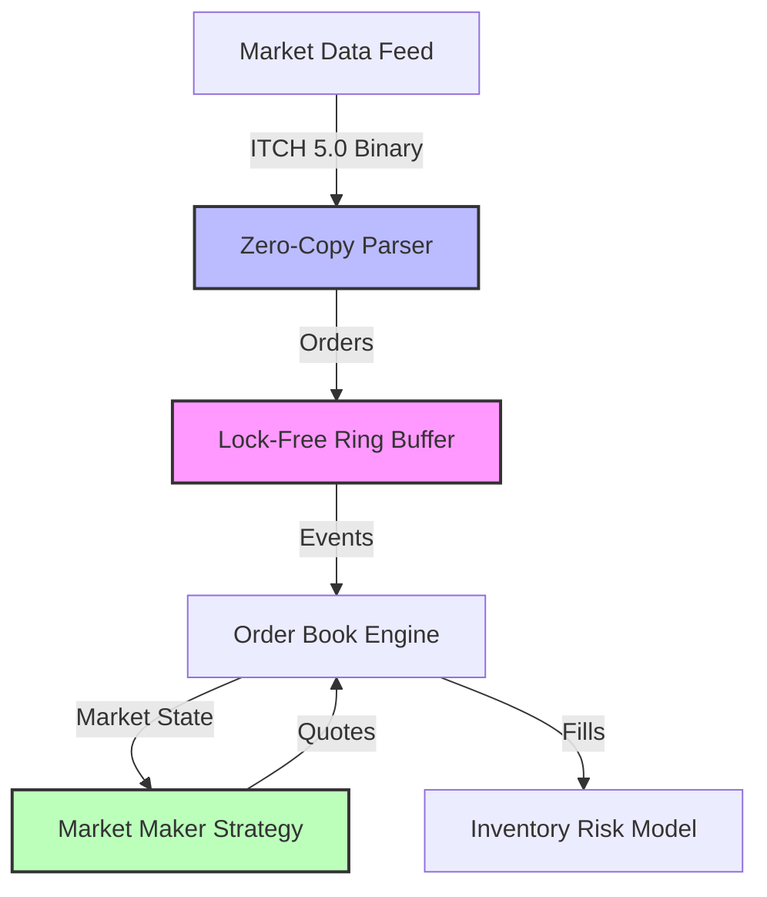

# MiniHFT - High-Frequency Trading Engine

[]()
[](LICENSE)
[](https://isocpp.org/)
[]()

> A production-grade educational HFT engine demonstrating advanced C++, quantitative finance, and low-latency systems concepts.

**Built for learning**: Lock-free concurrency, NASDAQ ITCH 5.0 parsing, market microstructure, and hardware acceleration.

---

## 🎯 Why This Project?

This project showcases the intersection of **quantitative finance**, **systems programming**, and **mathematical modeling**:

- **For Recruiters**: Demonstrates production HFT concepts (lock-free data structures, ITCH protocol, kernel bypass)
- **For Learners**: Complete implementation from math fundamentals to hardware simulation
- **For Researchers**: Reference implementation of Avellaneda-Stoikov market making model

## 🏗️ Architecture



## 🚀 Features

### Core Infrastructure
- ✅ **Lock-Free Ring Buffer** - Disruptor pattern, ~1.5μs latency
- ✅ **Thread Pinning** - CPU core isolation for deterministic performance
- ✅ **Zero-Copy Parsing** - Direct memory mapping, no allocations
- ✅ **Cache Optimization** - `alignas(64)` to prevent false sharing

### Market Microstructure
- ✅ **Limit Order Book** - Price-time priority matching engine
- ✅ **NASDAQ ITCH 5.0 Parser** - Binary protocol with endianness conversion
- ✅ **Market Simulator** - Synthetic order flow generation

### Quantitative Models
- ✅ **Avellaneda-Stoikov** - Inventory risk model with optimal quoting
- ✅ **Statistics Library** - Mean, variance, covariance, moving averages
- ✅ **Matrix Operations** - Template-based linear algebra

### Hardware Concepts
- ✅ **FPGA Pipeline Simulation** - 3-stage pipelined processing
- ✅ **Kernel Bypass Simulation** - Poll Mode Driver (PMD) concept

## 📊 Performance

| Component | Latency | Throughput |
|-----------|---------|------------|
| Ring Buffer (inter-thread) | ~1.5 μs | 1M+ msg/sec |
| Order Book Match | ~50 ns | 20M+ ops/sec |
| ITCH Parser | ~10 ns/msg | 100M+ msg/sec |

*Benchmarked on Intel i7 @ 3.0GHz*

## 🛠️ Build Instructions

### Prerequisites
- **Windows**: Visual Studio 2022 (MSVC v19.44+)
- **Linux**: GCC 11+ or Clang 14+
- C++20 support required

### Windows (MSVC)
```bash
# Direct compilation
compile_direct.bat

# Or using CMake
mkdir build && cd build
cmake ..
cmake --build . --config Release
```

### Linux (GCC/Clang)
```bash
mkdir build && cd build
cmake -DCMAKE_BUILD_TYPE=Release ..
make -j$(nproc)
```

## 🎓 Learning Path

The project is structured as a learning journey:

1. **Foundation** ([docs/cpp_learning_guide.md](docs/cpp_learning_guide.md))
   - Templates, atomics, memory alignment
   - Statistics and linear algebra

2. **Hard Mode** ([hard_mode_walkthrough.md](docs/hard_mode_walkthrough.md))
   - Lock-free programming
   - Protocol parsing
   - Hardware simulation

3. **Implementation** ([learning_roadmap.md](learning_roadmap.md))
   - Step-by-step guide from basics to advanced

## 📁 Project Structure

```
MiniHFT/
├── include/               # Header-only libraries
│   ├── Matrix.hpp        # Template matrix class
│   ├── Statistics.hpp    # Stats functions
│   ├── RingBuffer.hpp    # Lock-free SPSC queue
│   ├── OrderBook.hpp     # Limit order book
│   ├── ItchParser.hpp    # NASDAQ ITCH 5.0
│   ├── Strategy.hpp      # Avellaneda-Stoikov
│   ├── FpgaPipeline.hpp  # Hardware simulation
│   └── KernelBypass.hpp  # PMD simulation
├── src/                  # Test/benchmark programs
├── docs/                 # Documentation
└── .github/workflows/    # CI/CD
```

## 🧪 Running Examples

### Basic Market Making
```bash
strat_test.exe
# Output: Demonstrates inventory risk adjustment
```

### ITCH Protocol Parsing
```bash
gen_itch.exe    # Generate binary data
itch_test.exe   # Parse and display
```

### Performance Benchmarks
```bash
ring_bench.exe  # Ring buffer latency
hw_bench.exe    # Hardware simulation
```

## 📚 Key Concepts Demonstrated

### C++ Systems Programming
- **Atomics & Memory Ordering**: `std::memory_order_acquire/release`
- **Cache Line Alignment**: `alignas(64)` to prevent false sharing
- **Zero-Copy Techniques**: `reinterpret_cast` over packed structs
- **Template Metaprogramming**: Generic matrix and statistics libraries

### Quantitative Finance
- **Market Making**: Bid/ask spread optimization
- **Inventory Risk**: Avellaneda-Stoikov reservation price
- **Volatility Modeling**: Statistical measures for risk management

### Low-Latency Engineering
- **Thread Affinity**: `SetThreadAffinityMask` for core pinning
- **Lock-Free Data Structures**: SPSC ring buffer
- **Network Protocols**: Binary message parsing (ITCH 5.0)
- **Hardware Acceleration**: FPGA pipeline concepts

## 🎯 Use Cases for Quant Roles

This project demonstrates skills relevant to:
- **Quant Developer**: C++ optimization, low-latency systems
- **Algo Trading Engineer**: Market microstructure, order book dynamics
- **Quant Researcher**: Mathematical finance models, backtesting
- **HFT Engineer**: Lock-free programming, network protocols

## 📖 Documentation

- [C++ Learning Guide](docs/cpp_learning_guide.md) - Language features explained
- [Hard Mode Walkthrough](docs/hard_mode_walkthrough.md) - Advanced concepts
- [Learning Roadmap](learning_roadmap.md) - Structured learning path

## 🤝 Contributing

This is an educational project. Contributions welcome:
- Additional quant models (Ornstein-Uhlenbeck, SABR)
- Linux/Mac build support
- Performance optimizations
- Documentation improvements

## 📄 License

MIT License - see [LICENSE](LICENSE) file

## 🙏 Acknowledgments

**Concepts inspired by**:
- LMAX Disruptor Pattern
- Avellaneda & Stoikov (2008) - "High-frequency trading in a limit order book"
- NASDAQ TotalView-ITCH 5.0 Specification

---

**Author**: Built as a learning project for exploring HFT systems, C++, and quantitative finance.

**Status**: Educational/Research - Not for production trading
