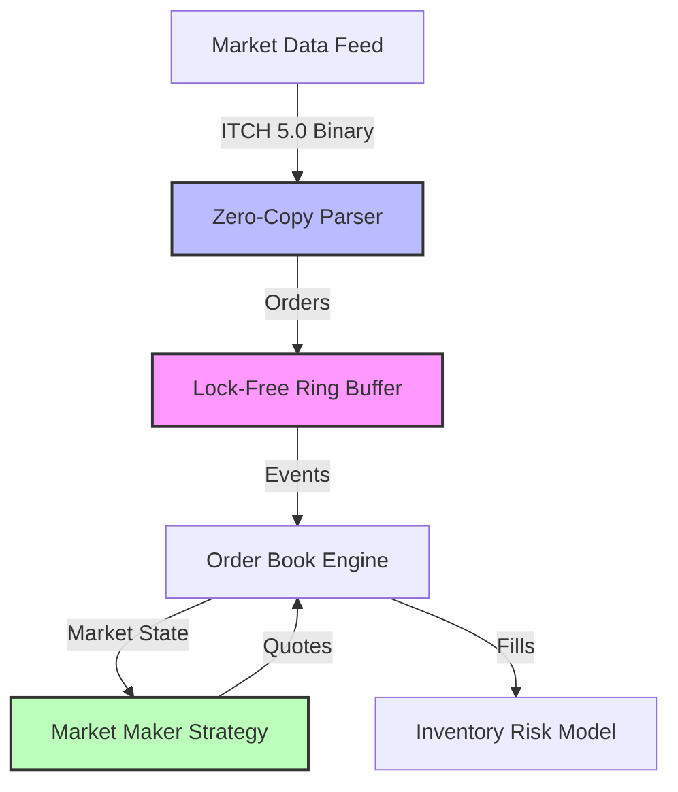

# MiniHFT - High-Frequency Trading Engine

[]()
[](LICENSE)
[](https://isocpp.org/)
[]()

> A production-grade educational HFT engine demonstrating advanced C++, quantitative finance, and low-latency systems concepts.

**Built for learning**: Lock-free concurrency, NASDAQ ITCH 5.0 parsing, market microstructure, and hardware acceleration.

---

## 🎯 Why This Project?

This project showcases the intersection of **quantitative finance**, **systems programming**, and **mathematical modeling**:

- **For Recruiters**: Demonstrates production HFT concepts (lock-free data structures, ITCH protocol, kernel bypass)
- **For Learners**: Complete implementation from math fundamentals to hardware simulation
- **For Researchers**: Reference implementation of Avellaneda-Stoikov market making model

## 🏗️ Architecture


```mermaid
graph TB
    MD[Market Data Feed] -->|ITCH 5.0 Binary| Parser[Zero-Copy Parser]
    Parser -->|Orders| RB1[Lock-Free Ring Buffer]
    RB1 -->|Events| OB[Order Book Engine]
    OB -->|Market State| MM[Market Maker Strategy]
    MM -->|Quotes| OB
    OB -->|Fills| Risk[Inventory Risk Model]

    style RB1 fill:#f9f,stroke:#333,stroke-width:2px
    style Parser fill:#bbf,stroke:#333,stroke-width:2px
    style MM fill:#bfb,stroke:#333,stroke-width:2px
```

## 🚀 Features

### Core Infrastructure
- ✅ **Lock-Free Ring Buffer** - Disruptor pattern, ~50 ns median one-way latency between pinned cores on one CCD, ~175 ns across CCDs
- ✅ **Thread Pinning** - CPU core isolation for deterministic performance
- ✅ **Zero-Copy Parsing** - Direct memory mapping, no allocations
- ✅ **Cache Optimization** - `alignas(64)` to prevent false sharing

### Market Microstructure
- ✅ **Limit Order Book** - Price-time priority matching engine
- ✅ **L3 Order Book** - Price levels with a FIFO per level and O(1) lookup by order reference; a full NASDAQ trading day replayed through it ([design and results](docs/order_book.md))
- ✅ **Strategy Hook** - A top-of-book listener passed as a template parameter and checked by a concept; inlined, and generating no code when unused. Hot paths are verified allocation-free in CI ([measurements](docs/zero_overhead.md))
- ✅ **NASDAQ ITCH 5.0 Parser** - Streams NASDAQ's length-prefixed files (whole days, from a file or a `gzip -dc` pipe) and decodes every order message type
- ✅ **Market Simulator** - Synthetic order flow generation

### Quantitative Models
- ✅ **Avellaneda-Stoikov** - Inventory risk model with optimal quoting
- ✅ **Statistics Library** - Mean, variance, covariance, moving averages
- ✅ **Matrix Operations** - Template-based linear algebra

### Hardware Concepts
- ✅ **FPGA Pipeline Simulation** - 3-stage pipelined processing
- ✅ **Kernel Bypass Simulation** - Poll Mode Driver (PMD) concept

## 📊 Performance

Measured on an AMD Ryzen 9 9900X3D, Windows 11 and WSL2. Unless a table says 12 cores, it ran with one CCD enabled and SMT off (6 cores). Timestamps come from the CPU's time-stamp counter, and percentiles from `LatencyHistogram` (at most 1.6 % bucket error). Every figure includes about 10 ns of timer overhead.

### Ring buffer: one-way latency between two pinned threads

`ring_latency`: one message every 1 µs from core 2 to core 3 (same CCD), 1,000,000 measured after 50,000 warm-up.

| Configuration | p50 | p90 | p99 | p99.9 | max |
|---------------|-----|-----|-----|-------|-----|
| Windows, MSVC, high priority | 50 ns | 70 ns | 0.9 µs | 222 µs | 500 µs |
| Windows, MSVC, normal priority | 70 ns | 80 ns | 140 µs | 530 µs | 1.06 ms |
| Linux (WSL2), GCC 13, normal priority | 71 ns | 113 ns | 103 µs | 313 µs | 534 µs |

- The hop itself is ~50–70 ns. The tail is set by the operating system: on a 6-core desktop the spinning threads get preempted. Across repeated runs, normal-priority medians ranged from 70 ns to 6 µs, and high-priority p99 from 0.9 to 16 µs. Isolated cores on native Linux (roadmap W03) should shrink the tail further.
- Measured from each message's *scheduled* send time rather than its actual send time, p99.9 reaches several milliseconds. One stall delays every message queued behind it, and measuring from the actual send hides that (coordinated omission).
- With back-to-back sends (`--interval-ns=0`) the median is 23–34 µs. That's queueing: each message waits behind up to 1,023 others.
- The table above was measured on the original queue. Since W03, `RingBuffer` uses release stores instead of `fetch_add` and caches the other side's index. Back-to-back throughput went from 39 to 6.4 ns per message (25 → 160 M msg/s), and the paced median is ~50 ns. See [RingBuffer v2](docs/ring_buffer_v2.md) for each change measured on its own.

With both CCDs enabled (12 cores, SMT on), `RingBuffer` v2, MSVC and high priority. Each cell is the range over two runs:

| 12 cores | p50 | p90 | p99 | p99.9 | max |
|----------|-----|-----|-----|-------|-----|
| Same CCD (cores 4 → 6) | 50 ns | 61 ns | 71 ns | 0.85–1.0 µs | 17–20 µs |
| **Across CCDs** (cores 4 → 16) | **171–180 ns** | 262–291 ns | 320–331 ns | 1.7–1.9 µs | 19–81 µs |

- **Twice the cores cut the tail by two orders of magnitude.** The same high-priority run that had a p99 of 0.9 µs on 6 cores has one of 71 ns on 12, and p99.9 drops from 222 µs to under 1 µs. Windows now has idle cores to run its own work on. This compares against the original queue, but the median hop is the same 50 ns for both, so the queue change doesn't account for the tail.
- **Crossing CCDs adds about 125 ns per hop.** The cache line has to cross the I/O die. Keep a producer and its consumer on one CCD. What crossing does to each queue design is in [RingBuffer v2](docs/ring_buffer_v2.md#across-ccds).

### Order book: one update, original book vs L3 book

`orderbook_latency`: both books hold a fixed number of resting orders per side (the depth) and see the identical event sequence. A *take* removes the best resting order on one side: the original book adds an aggressive order and matches it, the L3 book receives an execution. A *make* restores the depth at a random level. MSVC, p50 in ns:

| Depth | take: original → L3 | make: original → L3 |
|------:|---------------------|---------------------|
| 10 | 131 → **20** | 20 → **20** |
| 100 | 191 → **20** | 50 → **20** |
| 1000 | 1,005 → **20** | 371 → **20** |

The original book keeps each side as a sorted `std::vector` of orders, so its cost grows linearly with depth: inserting at, or erasing from, the front shifts every order. The L3 book stays flat. Details: [docs/order_book.md](docs/order_book.md).

### A full NASDAQ trading day

`itch_replay` streamed NASDAQ's TotalView-ITCH 5.0 sample for 30 Dec 2019 through the L3 book: every symbol, every order event. GCC 13 under WSL2.

| | |
|---|---|
| Messages | 268,744,780 (8.25 GB uncompressed) |
| End to end, including decompression in a `gzip -dc` pipe | 2.92–2.98 M messages/s (90–92 s) |
| Book update per order message | p50 131 ns, p90 284–291 ns, p99 495–502 ns, p99.9 757–786 ns (mean 168–173 ns) |
| Peak live orders | 1,924,078 |
| Events for unknown orders, over-executions | 0, 0 |
| Live orders at the end of the day | 0: every order added was executed, deleted or replaced |

A real day costs about 6× more per update than the synthetic benchmark, which keeps one book and its orders in cache. The replay touches thousands of books and a 2-million-order working set.

### Reproduce

```bash
cmake --preset gcc-release && cmake --build --preset gcc-release
./build/gcc-release/ring_latency --high-priority   # SCHED_FIFO needs root on Linux
./build/gcc-release/orderbook_latency
gzip -dc 12302019.NASDAQ_ITCH50.gz | ./build/gcc-release/itch_replay -   # sample day from emi.nasdaq.com
```

On Windows the programs are in `build/msvc-release/Release/`. They print the CPU, compiler and core pinning with their results. `--help` lists the options.

`powershell -ExecutionPolicy Bypass -File bench\run_ccd_matrix.ps1` builds on Windows, then runs the ring and order-book benchmarks on a core pair inside each CCD and on a pair across CCDs. It reads the CCD layout and SMT state from Windows and writes everything to `build\bench-results\`. `bench/run_ccd_matrix.sh` does the same on Linux, and can also replay the gzipped NASDAQ day on each CCD. Only native Linux gives meaningful CCD numbers, not WSL2. [Benchmarking on native Ubuntu](docs/native_linux.md) covers the setup.

## 🛠️ Build Instructions

### Prerequisites
- **Windows**: Visual Studio 2022 or newer, CMake 3.25+
- **Linux / WSL2**: GCC 13+ or Clang 18+, CMake 3.25+, Ninja
- GoogleTest and Google Benchmark are downloaded automatically on first configure

### Build and test
Each preset builds into `build/<preset>/`:

| Preset | Platform | Purpose |
|--------|----------|---------|
| `msvc-release` | Windows | Release build with MSVC |
| `gcc-release` | Linux | Release build with GCC |
| `clang-tsan` | Linux | Clang + ThreadSanitizer, for checking the lock-free code |
| `clang-asan-ubsan` | Linux | Clang + AddressSanitizer + UndefinedBehaviorSanitizer |
| `clang-fuzz` | Linux | libFuzzer target for the ITCH parser (`itch_fuzz`) |
| `clang-tidy` | Linux | Configure only: the compile database clang-tidy runs on |

Every preset treats warnings as errors. CI builds and tests the first four on each push, fuzzes for 60 s and runs clang-tidy; see [Code Quality](docs/code_quality.md).

```bash
cmake --preset gcc-release          # configure (use msvc-release on Windows)
cmake --build --preset gcc-release  # build all programs, tests and benchmarks
ctest --preset gcc-release          # run the unit tests
```

On WSL, build from the Linux filesystem (e.g. `~/code/MiniHFT`) rather than `/mnt/c`: it's much faster, and timing numbers from `/mnt/c` are meaningless.

## 🎓 Learning Path

The project is structured as a learning journey:

1. **Foundation** ([docs/cpp_learning_guide.md](docs/cpp_learning_guide.md))
   - Templates, atomics, memory alignment
   - Statistics and linear algebra

2. **Hard Mode** ([hard_mode_walkthrough.md](docs/hard_mode_walkthrough.md))
   - Lock-free programming
   - Protocol parsing
   - Hardware simulation

3. **Implementation** ([learning_roadmap.md](learning_roadmap.md))
   - Step-by-step guide from basics to advanced

## 📁 Project Structure

```
MiniHFT/
├── include/               # Header-only libraries
│   ├── Matrix.hpp        # Template matrix class
│   ├── Statistics.hpp    # Stats functions
│   ├── RingBuffer.hpp    # Lock-free SPSC queue
│   ├── OrderBook.hpp     # Limit order book (original, matches orders itself)
│   ├── L3OrderBook.hpp   # Order book built from order-level events
│   ├── ItchBook.hpp      # Applies ITCH events to one L3 book per instrument
│   ├── OrderIndex.hpp    # Order reference -> order, open addressing
│   ├── ObjectPool.hpp    # Allocation-free object recycling
│   ├── ItchMessages.hpp  # NASDAQ ITCH 5.0 message layouts
│   ├── ItchParser.hpp    # Streaming ITCH reader
│   ├── Strategy.hpp      # Avellaneda-Stoikov
│   ├── FpgaPipeline.hpp  # Hardware simulation
│   └── KernelBypass.hpp  # PMD simulation
├── src/                  # Test/benchmark programs
├── docs/                 # Documentation
└── .github/workflows/    # CI/CD
```

## 🧪 Running Examples

### Basic Market Making
```bash
strat_test.exe
# Output: Demonstrates inventory risk adjustment
```

### ITCH Protocol Parsing
```bash
gen_itch.exe    # Generate binary data
itch_test.exe   # Parse and display
```

### Performance Benchmarks
```bash
ring_latency       # Ring buffer one-way latency percentiles
orderbook_latency  # Original vs L3 order book, latency percentiles by depth
itch_replay        # Replay a NASDAQ ITCH day: throughput, latency, consistency checks
ring_buffer_bench  # Google Benchmark: single-thread push + pop
hw_bench           # Hardware simulation
```

## 📚 Key Concepts Demonstrated

### C++ Systems Programming
- **Atomics & Memory Ordering**: `std::memory_order_acquire/release`
- **Cache Line Alignment**: `alignas(64)` to prevent false sharing
- **Zero-Copy Techniques**: `reinterpret_cast` over packed structs
- **Template Metaprogramming**: Generic matrix and statistics libraries

### Quantitative Finance
- **Market Making**: Bid/ask spread optimization
- **Inventory Risk**: Avellaneda-Stoikov reservation price
- **Volatility Modeling**: Statistical measures for risk management

### Low-Latency Engineering
- **Thread Affinity**: `SetThreadAffinityMask` for core pinning
- **Lock-Free Data Structures**: SPSC ring buffer
- **Network Protocols**: Binary message parsing (ITCH 5.0)
- **Hardware Acceleration**: FPGA pipeline concepts

## 🎯 Use Cases for Quant Roles

This project demonstrates skills relevant to:
- **Quant Developer**: C++ optimization, low-latency systems
- **Algo Trading Engineer**: Market microstructure, order book dynamics
- **Quant Researcher**: Mathematical finance models, backtesting
- **HFT Engineer**: Lock-free programming, network protocols

## 📖 Documentation

- [C++ Learning Guide](docs/cpp_learning_guide.md) - Language features explained
- [Memory Ordering in RingBuffer](docs/memory_ordering.md) - Why each `memory_order` is there, ThreadSanitizer catching a broken copy, x86 vs ARM
- [RingBuffer v2](docs/ring_buffer_v2.md) - `fetch_add` → store, cached indices, false sharing and batching, each measured on its own
- [The L3 Order Book](docs/order_book.md) - Design, bugs fixed in the old ITCH code, old vs new, and a full NASDAQ day replayed
- [Zero-Overhead Extension Points](docs/zero_overhead.md) - Concepts for handlers and listeners, template vs virtual listener cost, the generated assembly, and zero-allocation tests
- [Code Quality](docs/code_quality.md) - Six bugs proven by failing tests and then fixed, hardened APIs, sanitizers, fuzzing, clang-tidy, and what CI checks
- [Hard Mode Walkthrough](docs/hard_mode_walkthrough.md) - Advanced concepts
- [Learning Roadmap](learning_roadmap.md) - Structured learning path

## 🤝 Contributing

This is an educational project. Contributions welcome:
- Additional quant models (Ornstein-Uhlenbeck, SABR)
- Linux/Mac build support
- Performance optimizations
- Documentation improvements

## 📄 License

MIT License - see [LICENSE](LICENSE) file

## 🙏 Acknowledgments

**Concepts inspired by**:
- LMAX Disruptor Pattern
- Avellaneda & Stoikov (2008) - "High-frequency trading in a limit order book"
- NASDAQ TotalView-ITCH 5.0 Specification

---

**Author**: Built as a learning project for exploring HFT systems, C++, and quantitative finance.

**Status**: Educational/Research - Not for production trading
