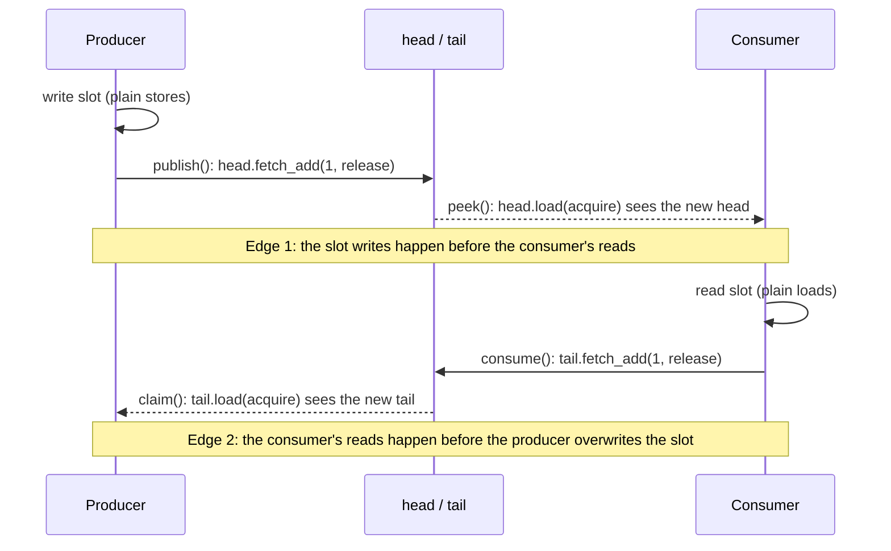

# Memory ordering in `RingBuffer`

[`RingBuffer`](../include/RingBuffer.hpp) is a single-producer / single-consumer queue built from two atomics, `head` and `tail`, and four memory orders. This page justifies each one. It then breaks one on purpose to show what ThreadSanitizer reports, and why the broken version still runs correctly on x86.

## Two hand-offs

Only the producer writes `head`, and only the consumer writes `tail`. The slots themselves are plain memory. What keeps them safe is two release/acquire pairs, one for each direction a slot travels:



A release store and an acquire load that reads its value *synchronize*. Everything the releasing thread did before the store then *happens before* everything the acquiring thread does after the load. With these two edges, no slot is ever accessed by both threads without an ordering between them, which is exactly what "no data race" means in C++.

## Every atomic, justified

| Call | Operation | Order | Why |
|------|-----------|-------|-----|
| `claim()` | `head.load` | relaxed | The producer is the only writer of `head`. Reading its own last store needs no synchronization. |
| `claim()` | `tail.load` | **acquire** | Edge 2. Once the producer sees the consumer's new `tail`, the consumer's reads of the freed slot happen before the producer's upcoming writes. |
| `publish()` | `head.fetch_add(1)` | **release** | Edge 1. Every write to the claimed slot happens before any consumer load that sees this `head`. |
| `peek()` | `tail.load` | relaxed | The consumer is the only writer of `tail`. |
| `peek()` | `head.load` | **acquire** | Edge 1. Seeing the new `head` makes the producer's slot writes visible. |
| `consume()` | `tail.fetch_add(1)` | **release** | Edge 2. The consumer's *reads* of the slot happen before the producer overwrites it. This one is easy to forget, because it protects a read rather than a write. |

Using `fetch_add` (a locked read-modify-write) is correct but more than needed: each index has a single writer, so `store(h + 1, release)` is enough, and on x86 it is a plain `mov` instead of `lock inc`. Roadmap W03 makes and measures that change.

## Breaking it on purpose

[`tests/RelaxedPublishRingBuffer.hpp`](../tests/RelaxedPublishRingBuffer.hpp) is a copy of the queue with one change: `publish()` uses `memory_order_relaxed`. The consumer's acquire load then has no release to synchronize with, so edge 1 is gone.

[`tests/relaxed_publish_demo.cpp`](../tests/relaxed_publish_demo.cpp) runs it through the [stress test](../tests/SpscStress.hpp). Each message is a full cache line: a sequence number, six payload words derived from it and a checksum. So a stale or half-written slot can't go unnoticed.

| Build | Result |
|-------|--------|
| MSVC, x86-64 (Ryzen 9 9900X3D) | 1,000,000 messages, **0 damaged** |
| GCC 13, x86-64 (same machine, WSL2) | 10,000,000 messages, **0 damaged** |
| Clang 18 + ThreadSanitizer | **data race reported** on the first run |

The ThreadSanitizer report, trimmed:

```text
WARNING: ThreadSanitizer: data race
  Read of size 8 at 0x72c400014080 by main thread:
    #0 runSpscStress<RelaxedPublishRingBuffer<StressMessage, 1024>>  tests/SpscStress.hpp:62   <- consumer copies the slot
  Previous write of size 8 at 0x72c400014080 by thread T1:
    #0 runSpscStress<...>::lambda                                    tests/SpscStress.hpp:52   <- producer writes slot->seq
  Location is heap block of size 65664 allocated by main thread      (the queue itself)
SUMMARY: ThreadSanitizer: data race tests/SpscStress.hpp:62:39
```

ThreadSanitizer doesn't wait for the reordering to happen. It tracks happens-before, and here it sees the producer write a slot and the consumer read it with no happens-before edge between them. That's why it finds a bug that ten million messages of stress testing on x86 cannot. CI runs this as `TSan.CatchesRelaxedPublish`, a test that passes only if ThreadSanitizer reports the race.

## Why x86 hides the bug

x86 follows *total store order* (TSO). Stores become visible to other cores in program order, and loads are not reordered with other loads. The only reordering x86 allows is a store followed by a load of a *different* address: the load can complete while the store is still in the core's store buffer. So on x86 every store already behaves like a release and every load like an acquire.

The compiler output shows it. Here are the same operations compiled with `clang -O2` (source below):

| Operation | x86-64 | ARM64 (ARMv8.0) | ARM64 (ARMv8.1 atomics) |
|-----------|--------|-----------------|--------------------------|
| `fetch_add(1, release)` | `lock incq` | `ldxr` / `add` / **`stlxr`** loop | **`ldaddl`** |
| `fetch_add(1, relaxed)` | `lock incq` | `ldxr` / `add` / `stxr` loop | `ldadd` |
| `load(acquire)` | `movq` | **`ldar`** | **`ldar`** |
| `load(relaxed)` | `movq` | `ldr` | `ldr` |

On x86 the broken `publish()` compiles to *exactly the same instructions* as the correct one. The mistake disappears in the machine code, so no test on this machine can catch it. On ARM the release version uses instructions with ordering semantics (`stlxr`, `ldaddl`, `ldar`) and the relaxed version doesn't. There, the slot writes (`stp`) may become visible to the consumer *after* the new `head`, and the consumer reads a stale slot.

The source is wrong on x86 too, not just on ARM. The compiler may move the plain slot stores after a relaxed atomic. Clang happened not to here, but a different compiler, flag or surrounding code could.

The same logic applies to `consume()`. With a relaxed `consume()`, ARM may let the producer see the new `tail` before the consumer's loads from the slot have completed, and overwrite the slot mid-read. x86 never reorders a load with a later store, so that bug hides on x86 too.

<details>
<summary>Source for the table</summary>

```c
typedef unsigned long size_t;
struct Q { size_t head; size_t slot[2]; };

void publish_release(struct Q* q, size_t v) { q->slot[0] = v; q->slot[1] = v * 3; __atomic_fetch_add(&q->head, 1, __ATOMIC_RELEASE); }
void publish_relaxed(struct Q* q, size_t v) { q->slot[0] = v; q->slot[1] = v * 3; __atomic_fetch_add(&q->head, 1, __ATOMIC_RELAXED); }
size_t load_acquire(struct Q* q) { return __atomic_load_n(&q->head, __ATOMIC_ACQUIRE); }
size_t load_relaxed(struct Q* q) { return __atomic_load_n(&q->head, __ATOMIC_RELAXED); }
```

```bash
clang -O2 -S -o - --target=x86_64-linux-gnu ordering.c
clang -O2 -S -o - --target=aarch64-linux-gnu -march=armv8-a ordering.c
clang -O2 -S -o - --target=aarch64-linux-gnu -march=armv8.1-a ordering.c
```

</details>

## Your call: when is `seq_cst` worth it?

**What release/acquire doesn't give you.** Acquire and release only order operations relative to the atomic they're attached to. They never stop a store from being overtaken by a *later load of a different variable*. That store→load reordering is the one x86 performs on its own: a store waits in the store buffer while the next load goes ahead.

**What breaks under exactly that.** Any protocol where two threads each write their own flag and then read the other's. Dekker's mutual exclusion is the textbook case (the "store buffering" litmus test). The one that bites in practice is a sleep/wake handshake:

```text
consumer, about to block              producer
  sleeping.store(true)                  head.store(h + 1)
  if (queue still empty) block()        if (sleeping.load()) wake()
```

With release/acquire, both loads may return the old values. The consumer sees an empty queue, the producer sees `sleeping == false`, and the consumer blocks with a message waiting and nobody to wake it: a lost wakeup. With `seq_cst` on those four operations (or a `seq_cst` fence between each store and the load after it), all four take their place in one global order, so at least one thread must see the other's store.

**What it costs.** Compiled with `clang -O2`, and timed in a tight loop on the Ryzen 9 9900X3D (GCC 13, WSL2, core 2):

| Operation | x86-64 | ARM64 | Cost on x86 |
|-----------|--------|-------|-------------|
| `store(release)` | `mov` | `stlr` | 0.4–0.7 ns |
| `store(seq_cst)` | `xchg` | `stlr` | 12–15 ns |
| `load(seq_cst)` | `mov` | `ldar` | same as acquire |

On x86 a `seq_cst` store has to drain the store buffer, which makes it 20–30× slower than a release store. `seq_cst` loads cost nothing extra. On ARM64 `seq_cst` loads and stores cost the same as acquire/release.

**Where I'd pay for it in a trading system:**
- Control paths where two threads must each see the other's write: sleep/wake handshakes for threads that block instead of spinning, shutdown and kill-switch handshakes, "last one out cleans up" logic.
- Anywhere I can't prove release/acquire is enough. That's why it's `std::atomic`'s default.

**Where I'd refuse:** the hot path of a queue like `RingBuffer`. Each index has one writer and data flows one way, so the two release/acquire edges are all the ordering it needs. A busy-spinning consumer never sleeps, so there's no wakeup to lose. A `seq_cst` store in `publish()` would cost ~12 ns per message instead of ~0.5 ns, for no correctness gain. Today's `fetch_add` already pays that price, because every locked read-modify-write is a full barrier on x86. Roadmap W03 replaces it with a release store.

## Reproduce

```bash
cmake --preset clang-tsan && cmake --build --preset clang-tsan
ctest --preset clang-tsan -R "Stress|TSan"          # both stress tests + TSan catching the broken queue
./build/clang-tsan/relaxed_publish_demo 20000       # prints the full ThreadSanitizer report
./build/gcc-release/relaxed_publish_demo 10000000   # the same broken queue runs clean on x86
```
