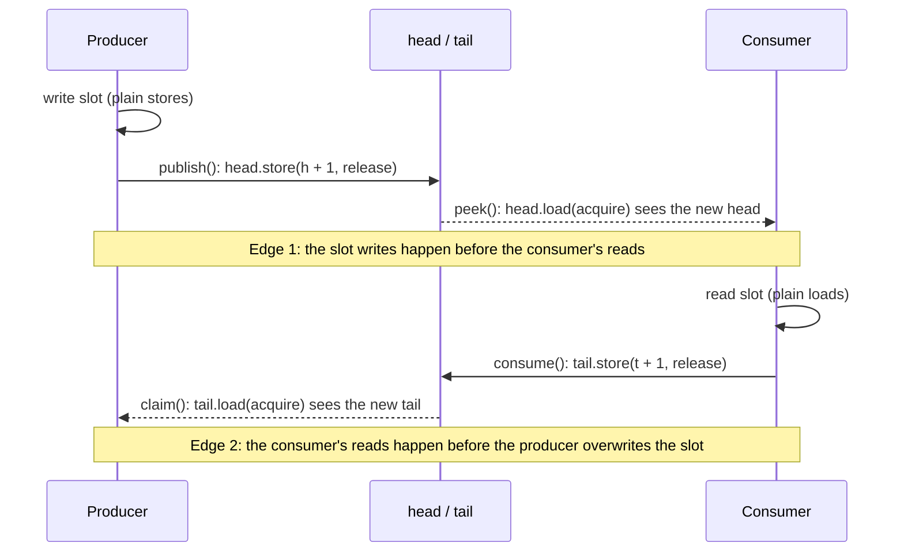

# Memory ordering in `RingBuffer`

[`RingBuffer`](../include/RingBuffer.hpp) is a single-producer / single-consumer queue built from two atomics, `head` and `tail`, and four memory orders. This page justifies each one. It then breaks one on purpose to show what ThreadSanitizer reports, why the broken version still runs correctly on x86, and how it fails on ARM.

## Two hand-offs

Only the producer writes `head`, and only the consumer writes `tail`. The slots themselves are plain memory. What keeps them safe is two release/acquire pairs, one for each direction a slot travels:


```mermaid
sequenceDiagram
    participant P as Producer
    participant A as head / tail
    participant C as Consumer
    P->>P: write slot (plain stores)
    P->>A: publish(): head.store(h + 1, release)
    A-->>C: peek(): head.load(acquire) sees the new head
    Note over P,C: Edge 1: the slot writes happen before the consumer's reads
    C->>C: read slot (plain loads)
    C->>A: consume(): tail.store(t + 1, release)
    A-->>P: claim(): tail.load(acquire) sees the new tail
    Note over P,C: Edge 2: the consumer's reads happen before the producer overwrites the slot
```

A release store and an acquire load that reads its value *synchronize*. Everything the releasing thread did before the store then *happens before* everything the acquiring thread does after the load. With these two edges, no slot is ever accessed by both threads without an ordering between them, which is exactly what "no data race" means in C++.

## Every atomic, justified

| Call | Operation | Order | Why |
|------|-----------|-------|-----|
| `claim()` | `head.load` | relaxed | The producer is the only writer of `head`. Reading its own last store needs no synchronization. |
| `claim()` | `tail.load` | **acquire** | Edge 2. Once the producer sees the consumer's new `tail`, the consumer's reads of the freed slot happen before the producer's upcoming writes. |
| `publish()` | `head.store(h + 1)` | **release** | Edge 1. Every write to the claimed slot happens before any consumer load that sees this `head`. |
| `peek()` | `tail.load` | relaxed | The consumer is the only writer of `tail`. |
| `peek()` | `head.load` | **acquire** | Edge 1. Seeing the new `head` makes the producer's slot writes visible. |
| `consume()` | `tail.store(t + 1)` | **release** | Edge 2. The consumer's *reads* of the slot happen before the producer overwrites it. This one is easy to forget, because it protects a read rather than a write. |

Two refinements from W03 ([ring_buffer_v2.md](ring_buffer_v2.md)) keep these edges intact:

- **`store` instead of `fetch_add`.** The original used `fetch_add`, a locked read-modify-write. Each index has a single writer, so a release `store` is enough. On x86 that's a plain `mov` instead of `lock inc`, and it made the queue about 6× faster.
- **Cached indices.** `claim()` and `peek()` now keep a private copy of the other side's index and do the acquire load only when that copy says the queue is full or empty. The edges still hold: an acquire that returned `H` synchronizes with the release that stored `H`, and that release came after the writes to *every* slot below `H`. So all the slots the cached value lets the consumer read are covered, and the same holds for `tail` in the other direction.

## Breaking it on purpose

[`tests/RelaxedPublishRingBuffer.hpp`](../tests/RelaxedPublishRingBuffer.hpp) is a copy of the original (W02) queue with one change: `publish()` uses `memory_order_relaxed`. The consumer's acquire load then has no release to synchronize with, so edge 1 is gone.

[`tests/relaxed_publish_demo.cpp`](../tests/relaxed_publish_demo.cpp) runs it through the [stress test](../tests/SpscStress.hpp). Each message is a full cache line: a sequence number, six payload words derived from it and a checksum. So a stale or half-written slot can't go unnoticed.

| Build | Result |
|-------|--------|
| MSVC, x86-64 (Ryzen 9 9900X3D) | 1,000,000 messages, **0 damaged** |
| GCC 13, x86-64 (same machine, WSL2) | 10,000,000 messages, **0 damaged** |
| Clang 18 + ThreadSanitizer | **data race reported** on the first run |
| GCC 13 and Clang 18, AArch64 (Arm Neoverse N2, CI runner), 8-slot queue | 30,000,000 messages, **damaged messages in every run** ([measured on ARM](#measured-on-arm)) |

The ThreadSanitizer report, trimmed:

```text
WARNING: ThreadSanitizer: data race
  Read of size 8 at 0x72c400014080 by main thread:
    #0 runSpscStress<RelaxedPublishRingBuffer<StressMessage, 1024>>  tests/SpscStress.hpp:62   <- consumer copies the slot
  Previous write of size 8 at 0x72c400014080 by thread T1:
    #0 runSpscStress<...>::lambda                                    tests/SpscStress.hpp:52   <- producer writes slot->seq
  Location is heap block of size 65664 allocated by main thread      (the queue itself)
SUMMARY: ThreadSanitizer: data race tests/SpscStress.hpp:62:39
```

ThreadSanitizer doesn't wait for the reordering to happen. It tracks happens-before, and here it sees the producer write a slot and the consumer read it with no happens-before edge between them. That's why it finds a bug that ten million messages of stress testing on x86 cannot. CI runs this as `TSan.CatchesRelaxedPublish`, a test that passes only if ThreadSanitizer reports the race.

## Why x86 hides the bug

x86 follows *total store order* (TSO). Stores become visible to other cores in program order, and loads are not reordered with other loads. The only reordering x86 allows is a store followed by a load of a *different* address: the load can complete while the store is still in the core's store buffer. So on x86 every store already behaves like a release and every load like an acquire.

The compiler output shows it. Here are the same operations compiled with `clang -O2` (source below):

| Operation | x86-64 | ARM64 (ARMv8.0) | ARM64 (ARMv8.1 atomics) |
|-----------|--------|-----------------|--------------------------|
| `fetch_add(1, release)` | `lock incq` | `ldxr` / `add` / **`stlxr`** loop | **`ldaddl`** |
| `fetch_add(1, relaxed)` | `lock incq` | `ldxr` / `add` / `stxr` loop | `ldadd` |
| `load(acquire)` | `movq` | **`ldar`** | **`ldar`** |
| `load(relaxed)` | `movq` | `ldr` | `ldr` |

On x86 the broken `publish()` compiles to *exactly the same instructions* as the correct one. The mistake disappears in the machine code, so no test on this machine can catch it. On ARM the release version uses instructions with ordering semantics (`stlxr`, `ldaddl`, `ldar`) and the relaxed version doesn't. There, the slot writes (`stp`) may become visible to the consumer *after* the new `head`, and the consumer reads a stale slot. On real ARM hardware, that is exactly what happens ([below](#measured-on-arm)).

The source is wrong on x86 too, not just on ARM. The compiler may move the plain slot stores after a relaxed atomic. Clang happened not to here, but a different compiler, flag or surrounding code could.

The same logic applies to `consume()`. With a relaxed `consume()`, ARM may let the producer see the new `tail` before the consumer's loads from the slot have completed, and overwrite the slot mid-read. x86 never reorders a load with a later store, so that bug hides on x86 too.

<details>
<summary>Source for the table</summary>

```c
typedef unsigned long size_t;
struct Q { size_t head; size_t slot[2]; };

void publish_release(struct Q* q, size_t v) { q->slot[0] = v; q->slot[1] = v * 3; __atomic_fetch_add(&q->head, 1, __ATOMIC_RELEASE); }
void publish_relaxed(struct Q* q, size_t v) { q->slot[0] = v; q->slot[1] = v * 3; __atomic_fetch_add(&q->head, 1, __ATOMIC_RELAXED); }
size_t load_acquire(struct Q* q) { return __atomic_load_n(&q->head, __ATOMIC_ACQUIRE); }
size_t load_relaxed(struct Q* q) { return __atomic_load_n(&q->head, __ATOMIC_RELAXED); }
```

```bash
clang -O2 -S -o - --target=x86_64-linux-gnu ordering.c
clang -O2 -S -o - --target=aarch64-linux-gnu -march=armv8-a ordering.c
clang -O2 -S -o - --target=aarch64-linux-gnu -march=armv8.1-a ordering.c
```

</details>

### Measured on ARM

CI also runs on a GitHub `ubuntu-24.04-arm` runner: 4 vCPUs of an Azure Cobalt 100, whose cores are Arm Neoverse N2. There the broken queue, built *without* ThreadSanitizer, delivers damaged messages:

| Queue, on Neoverse N2 | Messages per run | GCC 13 | Clang 18 |
|-----------------------|-----------------:|--------|----------|
| relaxed `publish()`, 1024 slots | 100M | damage in 2 of 6 runs (46 and 22 messages) | damage in 1 of 6 runs (1 message) |
| relaxed `publish()`, 8 slots | 30M | **damage in 8 of 8 runs**, 85 to 2,081 messages | **damage in 8 of 8 runs**, 2 to 4,772 messages |
| release `publish()` (the control), 8 slots | 30M | 0 in 5 runs | |
| release `publish()` (the control), 1024 slots | 100M | 0 in 7 runs | |

Almost every damaged message is a whole *stale* message. Its sequence number and payload are those of the slot's previous occupant, one lap earlier, and its checksum is consistent. The rest, a few percent, are *torn*: some of the producer's four 16-byte stores are visible and some aren't, so the checksum fails.

The compiler isn't the cause. GCC's producer loop, disassembled on the runner, keeps the stores in program order:

```text
stp  x19, x10, [x7, #128]       // seq, payload[0]
stp  x9, x8,   [x7, #144]       // payload[1], payload[2]
stp  x4, x3,   [x7, #160]       // payload[3], payload[4]
stp  x2, x5,   [x7, #176]       // payload[5], checksum
bl   __aarch64_ldadd8_relax     // head += 1: LDADD, no release
```

The CPU made the increment visible to the consumer before the four stores. With `memory_order_release` the call is `__aarch64_ldadd8_rel`, i.e. `LDADDL`, which can't become visible before earlier stores. That's the control row: no damage.

**Why 8 slots shows it so much more.** With 8 slots, the consumer read each slot less than a microsecond before the producer writes it again. So the slot's cache line is most likely still in the consumer's cache, and each slot store has to take it back first. A relaxed increment of `head` doesn't wait for that. (The cache states weren't measured.) With 1024 slots, damage only appeared in the runs where the two threads stayed in lock-step: those ran in 12–16 s instead of 6–7 s, and spent almost no time yielding on a full or empty queue.

**What it means:**
- The bug is real on hardware that's widely deployed (Graviton, Cobalt, Axion and Grace all use Neoverse cores), not only a rule of the C++ memory model.
- It's rare. With 8 slots, between 1 in 6,000 and 1 in 15 million messages was damaged. With 1024 slots it was about 1 in 10 million or fewer, and 9 of the 12 runs of 100M messages showed nothing at all. A stress test that passes on ARM is evidence, not proof. ThreadSanitizer, which also runs on the ARM runner in CI, found the race on the first run.
- So a stress test needs millions of messages on ARM. Natively on AArch64 every SPSC stress test (`RingBuffer`, the W03 variants and `KernelBypass`) sends 5M (`stressCount()` in [`SpscStress.hpp`](../tests/SpscStress.hpp)). x86 and ThreadSanitizer builds keep 100,000–300,000. At the rates GCC showed above, a relaxed `publish()` would damage roughly 14 to 350 of the 5M with 8 slots. With 1024 slots it would damage about one, and often none: a ring that large catches this bug only now and then, even at 5M. So every W03 variant also runs with 8 slots. Only `KernelBypass`, whose ring is fixed at 1024 descriptors, has no small-ring test.

CI keeps the measurement as a test: `ARM.RelaxedPublishDamagesMessages`, registered for native AArch64 builds without a sanitizer. It runs the 8-slot broken queue in rounds of 10M messages, up to 300M, and passes once a round delivers a damaged message. On the N2 runner it passed 11 of 11 times, taking 0.7–6.3 s. It is the hardware counterpart of `TSan.CatchesRelaxedPublish`. Another ARM core may reorder less often. If it fails there, the hardware didn't show the reordering within 300M messages; it doesn't mean `RingBuffer` is broken.

## Your call: when is `seq_cst` worth it?

**What release/acquire doesn't give you.** Acquire and release only order operations relative to the atomic they're attached to. They never stop a store from being overtaken by a *later load of a different variable*. That store→load reordering is the one x86 performs on its own: a store waits in the store buffer while the next load goes ahead.

**What breaks under exactly that.** Any protocol where two threads each write their own flag and then read the other's. Dekker's mutual exclusion is the textbook case (the "store buffering" litmus test). The one that bites in practice is a sleep/wake handshake:

```text
consumer, about to block              producer
  sleeping.store(true)                  head.store(h + 1)
  if (queue still empty) block()        if (sleeping.load()) wake()
```

With release/acquire, both loads may return the old values. The consumer sees an empty queue, the producer sees `sleeping == false`, and the consumer blocks with a message waiting and nobody to wake it: a lost wakeup. With `seq_cst` on those four operations (or a `seq_cst` fence between each store and the load after it), all four take their place in one global order, so at least one thread must see the other's store.

**What it costs.** Compiled with `clang -O2`, and timed in a tight loop on the Ryzen 9 9900X3D (GCC 13, WSL2, core 2):

| Operation | x86-64 | ARM64 | Cost on x86 |
|-----------|--------|-------|-------------|
| `store(release)` | `mov` | `stlr` | 0.4–0.7 ns |
| `store(seq_cst)` | `xchg` | `stlr` | 12–15 ns |
| `load(seq_cst)` | `mov` | `ldar` | same as acquire |

On x86 a `seq_cst` store has to drain the store buffer, which makes it 20–30× slower than a release store. `seq_cst` loads cost nothing extra. On ARM64 `seq_cst` loads and stores cost the same as acquire/release.

**Where I'd pay for it in a trading system:**
- Control paths where two threads must each see the other's write: sleep/wake handshakes for threads that block instead of spinning, shutdown and kill-switch handshakes, "last one out cleans up" logic.
- Anywhere I can't prove release/acquire is enough. That's why it's `std::atomic`'s default.

**Where I'd refuse:** the hot path of a queue like `RingBuffer`. Each index has one writer and data flows one way, so the two release/acquire edges are all the ordering it needs. A busy-spinning consumer never sleeps, so there's no wakeup to lose. A `seq_cst` store in `publish()` would cost ~12 ns per message instead of ~0.5 ns, for no correctness gain. The original `fetch_add` paid exactly that price, because every locked read-modify-write is a full barrier on x86. Replacing it with a release store in W03 took burst throughput from 39 to 6 ns per message ([ring_buffer_v2.md](ring_buffer_v2.md)).

## Reproduce

```bash
cmake --preset clang-tsan && cmake --build --preset clang-tsan
ctest --preset clang-tsan -R "Stress|TSan"          # both stress tests + TSan catching the broken queue
./build/clang-tsan/relaxed_publish_demo 20000       # prints the full ThreadSanitizer report
./build/gcc-release/relaxed_publish_demo 10000000   # the same broken queue runs clean on x86
```

On AArch64 Linux (CI uses `ubuntu-24.04-arm`):

```bash
cmake --preset gcc-release && cmake --build --preset gcc-release
./build/gcc-release/relaxed_publish_demo 30000000 small           # stale and torn messages
./build/gcc-release/relaxed_publish_demo 30000000 release small   # the control: none
ctest --preset gcc-release -R ARM                                  # passes only if damage shows up
```
